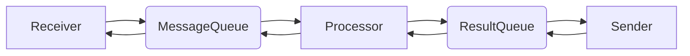

# gonebot
A Golang chatbot, currently support onebotv11.  
## Catalog
- [gonebot](#gonebot)
  - [Catalog](#catalog)
  - [Why gonebot?](#why-gonebot)
  - [How to create a bot](#how-to-create-a-bot)
  - [How to create a plugin](#how-to-create-a-plugin)
  - [The logic of gonebot](#the-logic-of-gonebot)
  - [TODO](#todo)
## Why gonebot?
- Easy to use. You can easily [load plugins](#how-to-create-a-bot) or [create them](#how-to-create-a-plugin) with less than 10 lines of code!  
- High Performance. Powered by golang, we use minimum CPU and memory resource.
- Portable. Static compilation means you can compile the bot into an excutable file.
## How to create a bot
You can refer to [gonedemo](https://github.com/gonebot-dev/gonedemo)
```
package main
import (
	"github.com/gonebot-dev/gonebot"
	"github.com/gonebot-dev/gonebot/plugins/builtinplugins"
)
func main() {
	gonebot.LoadPlugin(builtinplugins.Echo)
	gonebot.StartBackend("onebot11")
}
```
Done. Two lines, one bot.
## How to create a plugin
To create a plugin, you need to implement a [`GonePlugin` struct](./plugins/pluginStruct.go).
```go
type GoneHandler struct {
	Command []string
	Handler func(msg messages.MessageStruct) messages.ResultStruct
}
type GonePlugin struct {
	Name        string
	Description string
	Handlers    []GoneHandler
}
```
For example:
```go
func handler(msg messages.MessageStruct) messages.ResultStruct {
	var result messages.ResultStruct
	result.Text = msg.Text
	return result
}
var Echo plugins.GonePlugin
Echo.Name = "echo"
echoHandler := plugins.GoneHandler{}
echoHandler.Command = []string{"echo"}
echoHandler.Handler = handler
Echo.Handlers = append(Echo.Handlers, echoHandler)
```
Your handler get a `MessageStruct` variable. You can analyze it and return a `ResultStruct`. Make use of your IDE's hint plugin!
## The logic of gonebot
How does gonebot work?  
1. Gonebot initialize: loading [configuations](./configuations/) and [plugins](./plugins/pluginManager.go).  
2. First, the backend connect to the frontend and decode raw json payload into a [`MessageStruct`](./messages/messageStruct.go). The `MessageStruct` will be pushed into [`MessageQueue`](./messages/messageQueue.go). This is the main thread, loop in [`backend`](./backend/) section.  
3. The `Processor` will fetch messages from [`MessageQueue`](./messages/messageQueue.go), then invoke the `handler(MessageStruct)` of the plugins. The result [`resultStruct`](./messages/resultStruct.go) will be push into [`resultQueue`](./messages/resultQueue.go). This is the second thread.
4. The `backend` will fetch results from [`resultQueue`] and send the results to frontend. This is the third thread.
Step 2-4 will loop to finish all the jobs.


## TODO
- [x] Rewrite queues using channel.
- [ ] Docs about how to create a plugin.
- [x] Dotenv configuation file support.
- [ ] Images message support.
- [ ] README_CN.
- [ ] Plugin repository.
- [ ] Multiple adaptor support.
- [ ] Advanced context support.