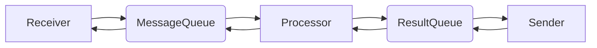

# gonebot
A Golang chatbot, support onebot_v11.
## Why gonebot?
Easy to use. You can easily [load plugins](#how-to-create-a-bot) or [create them](#how-to-create-a-plugin).  
Better Performance. Powered by golang.
## How to create a bot
```
TODO
```
## How to create a plugin
To create a plugin, you need to implement a [`GonePlugin` struct](./plugins/pluginStruct.go) and simply load it.  

## The logic of gonebot
How does gonebot work?  
1. Gonebot initialize: loading [configuations](./configuations/) and [plugins](./plugins/pluginManager.go).  
2. First, the backend connect to the frontend and decode raw json payload into a [`MessageStruct`](./messages/messageStruct.go). The `MessageStruct` will be pushed into [`MessageQueue`](./messages/messageQueue.go). This is the main thread, loop in [`backend`](./backend/) section.  
3. The `Processor` will fetch messages from [`MessageQueue`](./messages/messageQueue.go), then invoke the `handler(MessageStruct)` of the plugins. The result [`resultStruct`](./messages/resultStruct.go) will be push into [`resultQueue`](./messages/resultQueue.go). This is the second thread.
4. The `backend` will fetch results from [`resultQueue`] and send the results to frontend. This is the third thread.
Step 2-4 will loop to finish all the jobs.


## TODO
- [ ] Rewrite queues using channel.
- [ ] Docs about how to create a plugin.
- [ ] Images support.
- [ ] README_CN.