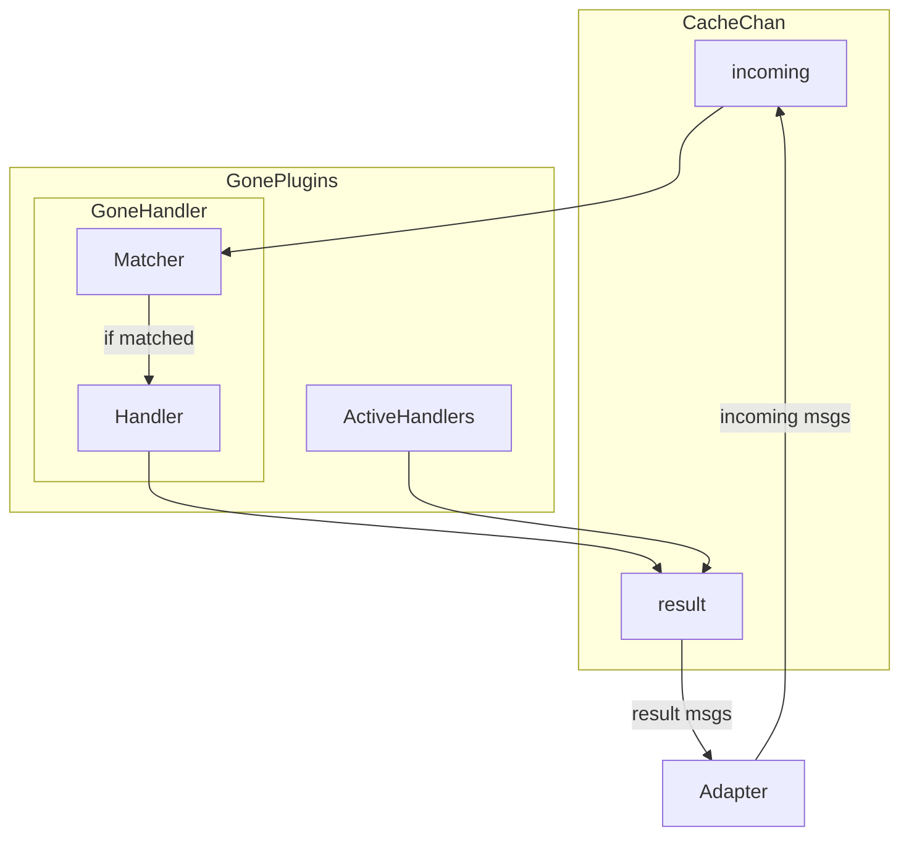

# Workflow

This document explains how gonebot works overall.

## Message Flow

```mermaid
flowchart TD
  subgraph CacheChan
    direction LR
    incoming
    result
  end

  subgraph GonePlugins
    direction TB
    subgraph GoneHandler
      direction TB
      Matcher -- "if matched" --> Handler
    end
    ActiveHandlers
  end

  Adapter -- "incoming msgs" --> incoming
  incoming --> Matcher
  Handler --> result
  ActiveHandlers --> result
  result -- "result msgs" --> Adapter
```

## CacheChan

The two channels work as message cache, in order to handle with sudden load.
